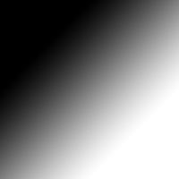
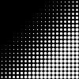
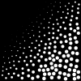
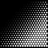
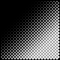

# svg-halftone

[](https://travis-ci.org/evestera/svg-halftone)
[](https://ci.appveyor.com/project/evestera/svg-halftone)

Tool for converting [raster] images (png, jpg, gif) to SVG [halftone] patterns
that can be cut on a laser cutter, turning the halftone dots into holes.

[raster]: https://en.wikipedia.org/wiki/Raster_graphics
[halftone]: https://en.wikipedia.org/wiki/Halftone

The tool comes as a CLI, detailed below, and as a web-based version at [halftone.vestera.as](https://halftone.vestera.as)

## Installation

There are precompiled binaries of releases on [the releases page](https://github.com/evestera/svg-halftone/releases).

If you have [Rust installed](https://rustup.rs/) you can build from source with:

```bash
cargo install --git https://github.com/evestera/svg-halftone
```

## Usage

```bash
svg-halftone my-image.jpg
```

### Options

From `svg-halftone --help`

- `--shape <shape>`: Shape used for samples. "circle", "hex" or "diamond". Defaults to the shape best suited to the chosen grid.
- `--grid <grid>`: Grid to lay samples out on. "rect", "hex", "diamond" or "poisson". Defaults to the grid best suited to the chosen shape. 
- `--contrast <contrast>`: Adjust contrast of input image before processing. Positive numbers increase contrast, negative numbers decrease it.
- `--invert`: Make shapes black on white. I.e. holes show a darker background.
- `--output <output>`: Output path [default: out.svg]
- `--output-width <output-width>`: Output width in mm [default: 300]
- `--spacing <spacing>`: Horizontal spacing between samples in mm [default: 5]
- `--cut-paths`: Draw cut paths only (no fill and background). I.e. make a file ready for cutting.

### Examples

Image used as input for these examples:



`--shape circle --grid rect` (default)



`--shape circle --grid poisson`



`--shape hex` (also sets `--grid hex`)



`--shape diamond` (also sets `--grid diamond`)



## Useful programs/tools

- [remove.bg](https://www.remove.bg/): Easily replace backgrounds of images of people with a single color.

- [Gapplin](http://gapplin.wolfrosch.com/) (macOS): SVG viewer which automatically redraws the file when it is updated.

## License

This project is licensed under the MIT License.